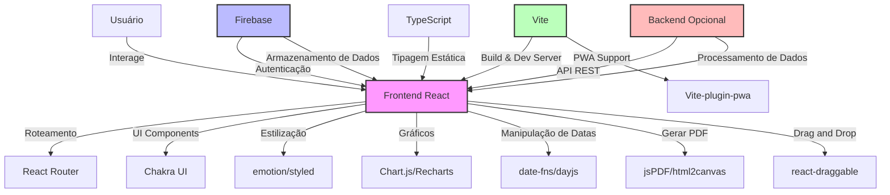
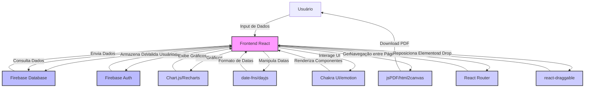

# Arquitetura

## Arquitetura geral do projeto.




## Fluxo de dados

## Fluxo de dados sequencial
```mermaid
sequenceDiagram
    participant U as Usuário
    participant FR as Frontend React
    participant FA as Firebase Auth
    participant FD as Firebase Database
    participant CG as Chart.js/Recharts
    participant DM as date-fns/dayjs
    participant PDF as jsPDF/html2canvas
    participant UI as Chakra UI/@emotion
    participant RR as React Router
    participant DR as react-draggable

    U->>FR: Input de Dados
    FR->>FA: Solicita Autenticação
    FA->>FR: Retorna Status
    FR->>FD: Armazena Dados
    FR->>FD: Consulta Dados
    FD->>FR: Envia Dados
    FR->>CG: Solicita Geração de Gráficos
    CG->>FR: Retorna Gráficos
    FR->>DM: Solicita Formatação de Datas
    DM->>FR: Retorna Datas Formatadas
    FR->>PDF: Solicita Geração de PDF
    PDF->>U: Fornece Download de PDF
    FR->>UI: Renderiza Componentes UI
    UI->>FR: Retorna UI Renderizada
    FR->>RR: Navegação entre Páginas
    RR->>FR: Completa Navegação
    FR->>DR: Inicia Drag and Drop
    DR->>FR: Completa Drag and Drop

    Note over U,FR: Fluxo principal de interação do usuário
    Note over FA,FD: Interações com Firebase
    Note over CG,PDF: Processamento de dados visuais e documentos
    Note over UI,RR: Gestão de UI e roteamento
    Note over DR: Funcionalidade interativa
